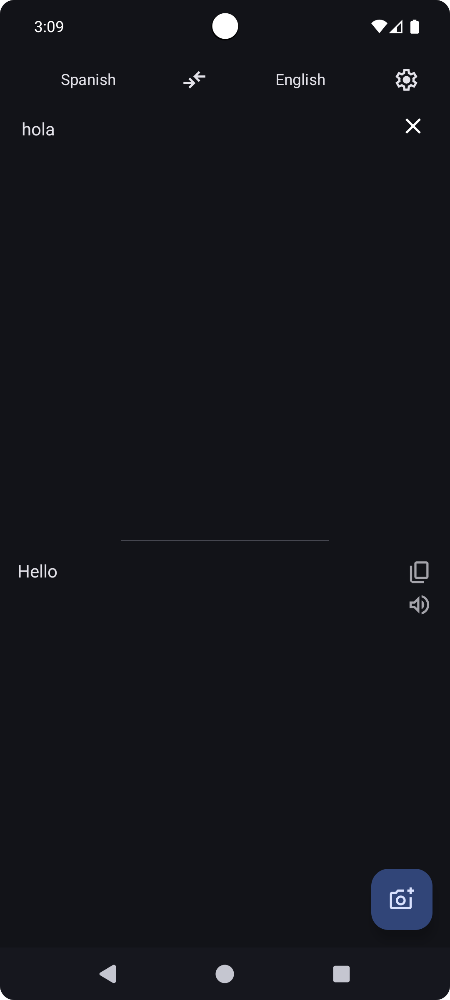
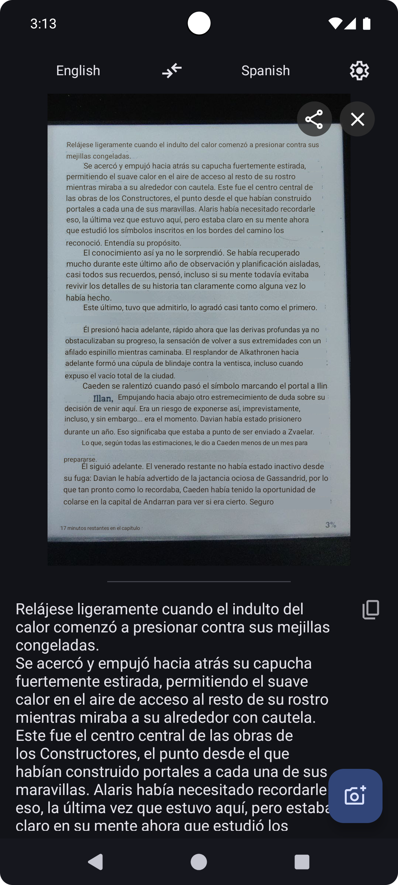
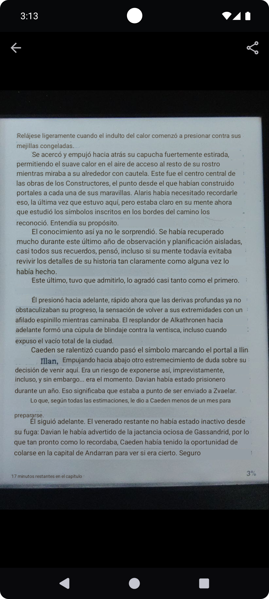
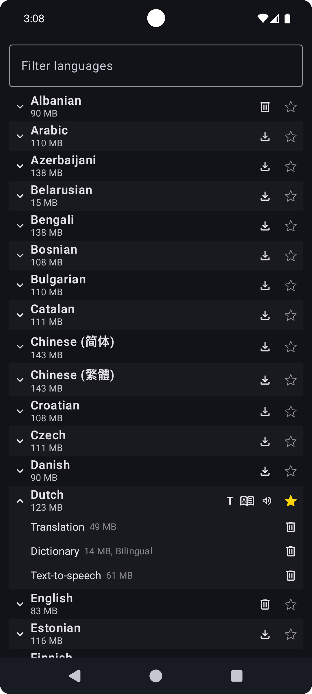
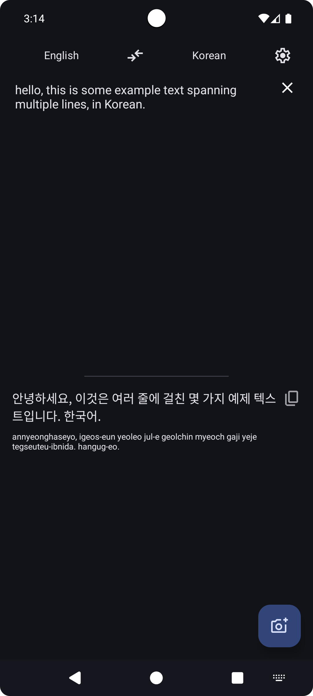

<h1><center>Translator</center></h1>

An Android translator app that performs text, PDF/ODT documents and image translation completely offline using on-device models.

Supports automatic language detection and transliteration for non-latin scripts. There's also a built-in word dictionary.

[](https://f-droid.org/packages/dev.davidv.translator)


## How It Works

**Complete offline translation** - download language packs once, translate forever without internet.

Language packs contain the full translation models, translation happens _on your device_, no requests are sent to external servers.

## Screenshots

[](fastlane/metadata/android/en-US/images/phoneScreenshots/01_main_interface.png)
[](fastlane/metadata/android/en-US/images/phoneScreenshots/02_image_translation.png)
[](fastlane/metadata/android/en-US/images/phoneScreenshots/04_image_translation_big.png)
[](fastlane/metadata/android/en-US/images/phoneScreenshots/05_language_packs.png)
[](fastlane/metadata/android/en-US/images/phoneScreenshots/03_transliteration.png)
[](fastlane/metadata/android/en-US/images/phoneScreenshots/07_dictionary.png)

## Tech

- Translation models are Firefox' [translations models](https://github.com/mozilla/translations)
  - The translation models run on a modified [slimt](https://github.com/jerinphilip/slimt)
- OCR models are [Tesseract](https://github.com/tesseract-ocr/tesseract)
- Automatic language detection is done via [cld2](https://github.com/CLD2Owners/cld2)
- Dictionary is based on data from Wiktionary, exported by [Kaikki](https://kaikki.org/)
  - For Japanese specifically, there's a second "word dictionary" (Mecab) for transliterating Kanji
- TTS uses [Piper](https://github.com/OHF-Voice/piper1-gpl), [Coqui](https://github.com/coqui-ai/tts), [Kokoro](https://github.com/hexgrad/kokoro), [MMS](https://huggingface.co/facebook/mms-tts), [Sherpa ONNX](https://github.com/k2-fsa/sherpa-onnx), [Mimic3](https://github.com/MycroftAI/mimic3) voices
- PDF surgery uses [mupdf](https://github.com/ArtifexSoftware/mupdf) and [lopdf](https://github.com/J-F-Liu/lopdf).

## Features & How to Use

| Feature | How to trigger |
|---|---|
| Translate text | Share text from any app, or type directly |
| Translate text (mini popup) | Long-press text on any app → tap "Translate" in the copy/share bar |
| Translate a URL | Share a link from any app |
| Translate an image | Share an image from any app |
| Translate a document | Open the documents tab inside the app |
| Dictionary lookup | Long-press a word inside the app |
| Change TTS voice / speed | Long-press the play button |

#### For developers

This app exposes an API (see `ITranslationService.aidl`) that other apps can use to request translations.


## Manual offline setup

If you want to use this app on a device with no internet access, you can put the language files on `Documents/dev.davidv.translator`. Check
`OFFLINE_SETUP.md` for details.

## Building

```sh
bash build.sh
```

will trigger a build in a docker container, matching the CI environment.

## Releasing

- Bump `app/build.gradle.kts` versionName and versionCode
- Create a changelog in `fastlane/metadata/android/en-US/changelogs` as `${versionCode*10+1}.txt` (and `+2`)
- Build: `bash build.sh`
- Sign: `bash sign-apk.sh keystore.jks keystorepass pass alias`
- Create a tag that is `v${versionName}` (eg: `v0.1.0`)
- Create a Github release named `v${versionName}` (eg: `v0.1.0`)
  - Upload both signed APKs to the release
  - `gh release create --prerelease v0.4.0-rc1 -F fastlane/metadata/android/en-US/changelogs/XX1.txt signed/translator-arm64-0.4.0.apk signed/translator-armv7-0.4.0.apk`

Each ABI gets a unique versionCode: `versionCode * 10 + abiOffset` (armv7=1, arm64=2, x86=3, x86\_64=4).

## Signing APK
```sh
bash sign-apk.sh keystore.jks keystorepass pass alias
```

will sign the APKs built by `build.sh` and place the signed copies in `signed/translator-{arm64,armv7}-${version}.apk`

### Verification info

SHA-256 hash of signing certificate: `2B:38:06:E7:45:D8:09:01:8A:51:BE:58:D0:63:5F:FC:74:CC:97:33:43:94:07:AB:1E:D0:42:4A:4D:B3:E1:FB`

## Funding


This project was funded through the [NGI Mobifree Fund](https://nlnet.nl/mobifree), a fund established by [NLnet](https://nlnet.nl).
